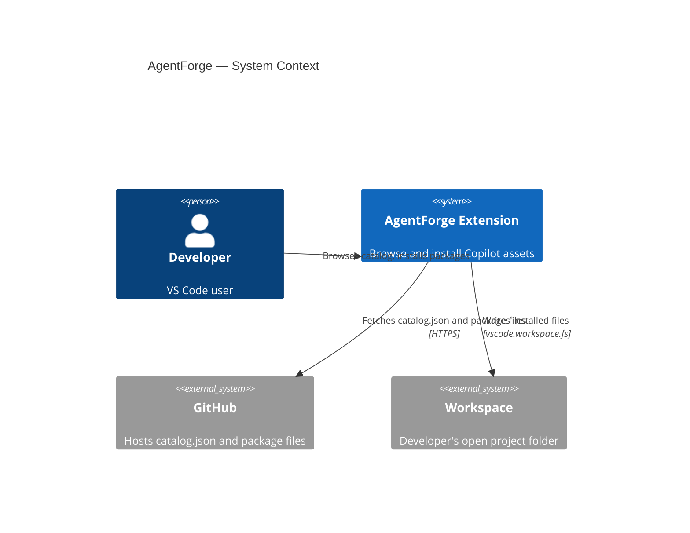
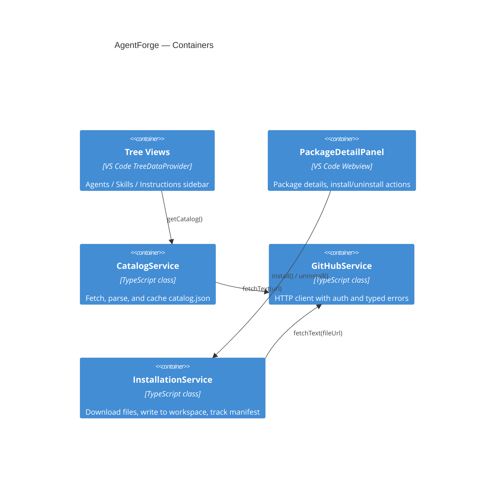

# Architecture

## Component Overview

## Key Design Decisions

### Single parameterised TreeProvider
One `CatalogTreeProvider` class handles all three categories (agents, skills, instructions) via a `category` constructor parameter, avoiding three near-identical classes.

### Typed GitHub error hierarchy
`GitHubError` → `GitHubAuthError` / `GitHubRateLimitError` allows `extension.ts` to surface actionable notifications ("Set Token" button on 401) without catch-all error swallowing.

### SecretStorage for tokens
GitHub tokens are stored in VS Code's encrypted `SecretStorage`, never in `settings.json` or `globalState`. This follows VS Code security best practice and prevents accidental token leakage in synced settings.

### TTL cache in globalState
`CatalogService` caches the fetched catalog in `ExtensionContext.globalState` with a configurable TTL. This survives VS Code restarts and avoids redundant network calls without requiring a local database.

### Manifest-tracked installs
`InstallationService` writes `.agentforge-manifest.json` to the workspace root. This enables clean uninstall (only remove files we wrote), update detection (compare versions), and recovery if files are manually deleted.

### Single-owner webview panel
`PackageDetailPanel` reuses the same panel instance across selections rather than opening multiple tabs. The panel updates in-place when a new package is selected, matching the UX pattern of VS Code's own settings/extension detail panels.
